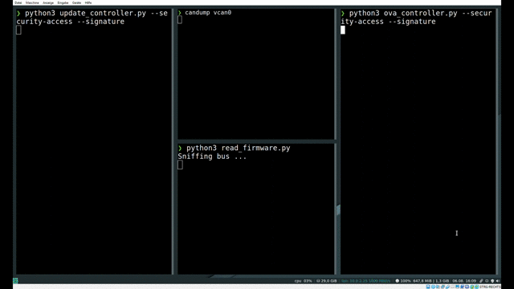

# Pets AP13 - Demonstrator

Das Ziel des Demonstrators ist es, die in EAST-ADL modellierten Sicherheitsmaßnahmen umzusetzen.
Als Beispiel wurde der Use-Case "Firmware-Update eines Steuergeräts über den CAN Bus" gewählt.
Bei der Modellierung mit EAST-ADL wurden folgende mögliche Schwachstellen identifiziert:

* Auslesen der Firmware während des Update Prozesses
* Manipulierte Firmware auf dem Steuergerät installieren 

Um diese Sicherheitslücken zu schließen implementiert der Demonstrator folgende Sicherheitsmechanismen:

* Verschlüsselung der Datenübertragung (AES-256)
* Firmware-Signatur (SHA-256/RSA-2048)
* UDS Security Access

Hierbei werden zwei Steuergeräte (*ova_controller.py* / *update_controller.py*) simuliert, die mit den im Automobilbereich verwendeten Protokollen ISO-TP und UDS kommunizieren. Dabei wartet der Update Controller ständig auf eine neue Firmware, welche vom OVA Controller übermittelt wird. Dieser sendet dafür das Skript *firmware.sh* im Ordner *firmware_gateway*, das nach der Übertragung ins *firmware_ecu* Verzeichnis geschrieben wird. 

# Usage

**1. python3 update_controller.py [optional flags]**

**2. python3 ova_controller.py [optional flags]**

Nachdem das Update übertragen wurde beendet sich der OVA Controller während der Update Controller in einer Endlosschleife läuft. Der Update Controller muss nur bei einer Änderung der Konfiguration (optional flags) neu gestartet werden. 
Um die Auswirkung der eingesetzten Sicherheitsmechanismen zu veranschaulichen, können diese über das jeweilige Flag hinzugeschaltet oder weggelassen werden.

* --encryption
* --signature
* --security-access

**Für einen erfolgreichen Update Prozess müssen beide Controller mit den selben Flags ausgeführt werden.**
Nebenbei kann das Bash Skript *selfdriving_controller.sh* gestartet werden. Es führt die übertragene Firmware in */firmware_ecu* permanent aus, womit sich die Auswirkungen eines Updates direkt beobachten lassen.
Neben den Flags für die Security Funktionen, lässt sich auch das CAN interface mit **--iface=_[CAN interface name]_** einstellen. Wird diese Option nicht genutzt, wird _vcan0_ als Standardeinstellung verwendet.

Zusätzlich zu den simulierten Steuergeräten befinden sich im Ordner *attacker* zwei Skripte um ein mögliches Angriffsszenario zu demonstrieren.

* manipulated_update.py [CAN interface name]

   - überträgt das Skript *malware.sh* an den Update Controller
   - wird anstatt des OVA Controllers ausgeführt
   - funktioniert nur wenn keins der _Security-Flags_ gesetzt ist

* read_firmware.py [CAN interface name]

   - liest die Daten, die mit dem UDS Service *Transfer Data* übertragen werden mit und gibt diese aus
   - muss vor dem Update gestartet werden und läuft in einer Endlossschleife
   - die mitgeschnittenen Daten sind nur ohne das _encryption_ Flag lesbar

**Bitte beachten**:
Der Demonstrator verwendet SocketCAN und kann somit nur auf einem Linux System ausgeführt werden. Außerdem muss zusätzlich zu den benötigten Python Modulen das ISO-TP Kernel Modul installiert werden.

